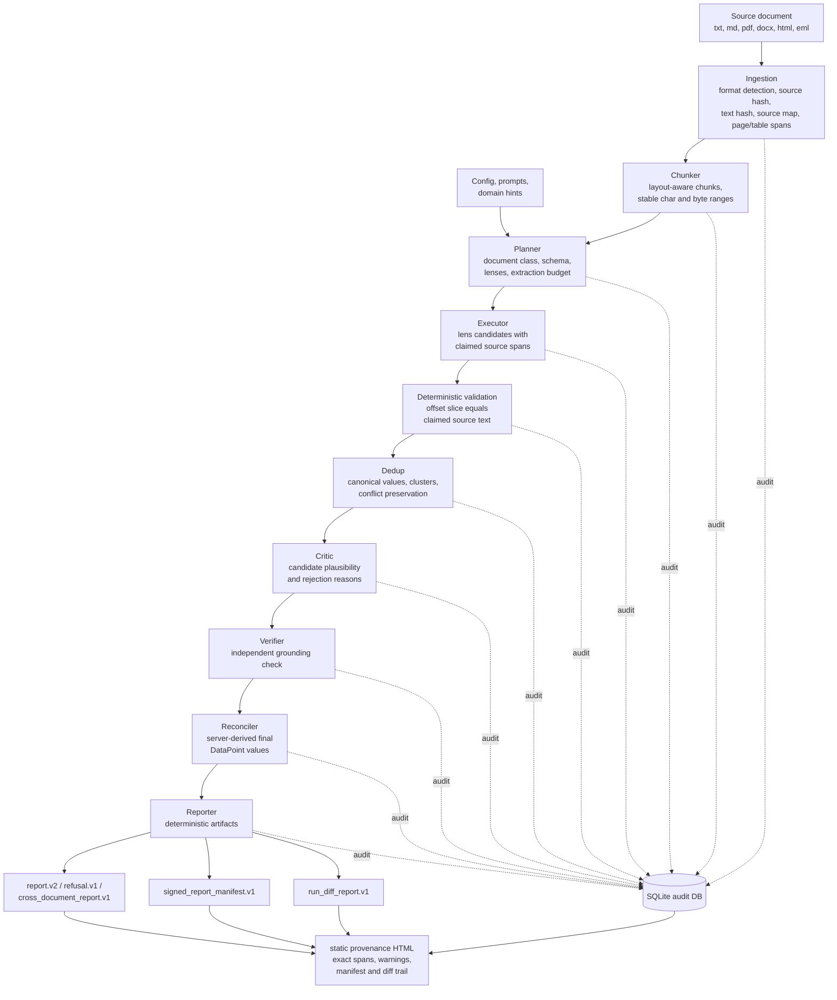

<div align="center">

# Veritext

### Research-grade, domain-neutral document extraction with exact source provenance

Veritext turns one source document into a list of typed `DataPoint` records, where **every reported value is locked to a byte-and-character span in the original text** — proposed by LLMs, then proven by deterministic checks and recorded in an immutable SQLite audit trail.

<br/>


<br/>

*Optimized for extraction accuracy, auditability, and invariant enforcement. Speed, cost, and convenience are secondary.*

</div>

---

## Table of Contents

- [Why Veritext](#why-veritext)
- [End-to-End Flow](#end-to-end-flow)
- [Supported Inputs and Outputs](#supported-inputs-and-outputs)
- [Installation](#installation)
- [Quickstart](#quickstart)
- [Command-Line Tools](#command-line-tools)
  - [Run an Extraction](#run-an-extraction)
  - [Inspect Audit State](#inspect-audit-state)
  - [Sign, Verify, Diff, and Render Provenance](#sign-verify-diff-and-render-provenance)
  - [Evaluations](#evaluations)
- [Development Checks](#development-checks)
- [Repository Map](#repository-map)
- [Design Rules](#design-rules)

---

## Why Veritext

Most extraction stacks treat an LLM's answer as the source of truth. Veritext treats it
as a **proposal** and refuses to report anything it cannot mechanically ground back to the
original document. That single inversion drives every design choice below.

| Principle | What it means in practice |
|---|---|
| 🔗 **Mechanical provenance** | Extracted spans must round-trip to the exact source text by character *and* byte offset. A claimed span that does not slice back to its quoted text is rejected. |
| 🧱 **Typed stage boundaries** | Every inter-stage contract is a Pydantic v2 model with strict validation — no loose dictionaries cross a stage boundary. |
| 🛠 **Forced structured LLM calls** | Every model call routes through `src/extractor/llm/client.py` using forced tool use. Free-text JSON parsing is not allowed. |
| 🚫 **No silent drops** | Rejected candidates are logged with explicit reason codes, never quietly discarded. |
| 🗄 **Audit-first runtime** | Source documents, chunks, LLM calls, candidates, rejections, stage states, manifests, and integrity events are all persisted in SQLite. |
| 📄 **Reporter-side provenance** | Static HTML artifacts are local, deterministic files — not a web UI, server, REST API, browser app, or alternate extraction path. |

> [!NOTE]
> Veritext is built for high-stakes, audit-heavy workflows — legal contracts, SEC filings,
> e-discovery, clinical-trial documents, FDA labels, regulatory rulings, insurance policies,
> patents, and compliance evidence. It is intentionally **not** a chatbot, RAG layer,
> summarizer, or search index.

---

## End-to-End Flow



The pipeline runs as ordered async stages:

```text
ingestion → chunker → planner → executor → dedup → critic → verifier → reconciler → reporter → audit store
```

---

## Supported Inputs and Outputs

<table>
<tr>
<th>📥 Source formats</th>
<th>📤 Output artifacts</th>
</tr>
<tr>
<td valign="top">

- `.txt`, `.text`
- `.md`, `.markdown`
- `.pdf`
- `.docx`
- `.html`, `.htm`
- `.eml`

</td>
<td valign="top">

- **`report.v2`** — deterministic report with ordered `DataPoint` records
- **`refusal.v1`** — audited schema-fit refusal when out of scope
- **`cross_document_report.v1`** — grouped cross-document facts and conflicts
- **`signed_report_manifest.v1`** — report/source/text/schema/prompt/config hashes plus signature metadata
- **`run_diff_report.v1`** — deterministic diff between two reports
- **Static provenance HTML** — local reviewer artifact built from a report, audit DB, and optional manifest/diff inputs

</td>
</tr>
</table>

---

## Installation

> **Requires Python 3.11 or newer.**

```bash
python3 -m pip install -e .
cp .env.example .env
```

Keep secrets in `.env`; provider and model settings live in YAML config.

| File | Role |
|---|---|
| `config/default.yaml` | Canonical runtime configuration. |
| `config/local.yaml` | Optional per-machine overrides for local runs. |
| `.env` | Secrets only — e.g. `ANTHROPIC_API_KEY`, `OPENAI_API_KEY`, `MOONSHOT_API_KEY`, `REPORT_SIGNING_KEY`. |

The default config uses Anthropic. OpenAI and OpenAI-compatible providers are also
supported — but **every** structured model call still goes through the same LLM client
boundary. After copying `.env.example`, set `ANTHROPIC_API_KEY` for the default config,
or override `llm.provider` in `config/local.yaml` and set the matching provider key.

---

## Quickstart

```bash
# 1. Extract a document into an audited report
veritext path/to/document.pdf \
  --output .veritext/reports/run-1.report.json \
  --run-id run-1 \
  --domain-hint legal_contracts

# 2. Inspect what happened, candidate by candidate
veritext-audit .veritext/audit.sqlite3 --run-id run-1 --details

# 3. Sign the report and render a reviewable provenance artifact
veritext-report sign .veritext/reports/run-1.report.json \
  --audit-db .veritext/audit.sqlite3 \
  --manifest-output .veritext/reports/run-1.report.manifest.json
```

---

## Command-Line Tools

Installing the package exposes four console scripts:

| Command | Purpose |
|---|---|
| `veritext` | Run the extraction pipeline on a document and write an audited report. |
| `veritext-audit` | Inspect persisted audit state for a run. |
| `veritext-report` | Sign, verify, diff, and render provenance artifacts from reports. |
| `veritext-eval` | Score reports against labeled fixtures and evaluation suites. |

### Run an Extraction

```bash
veritext path/to/document.pdf \
  --output .veritext/reports/run-1.report.json \
  --run-id run-1 \
  --domain-hint legal_contracts
```

Resume an interrupted audited run with the same run ID:

```bash
veritext path/to/document.pdf \
  --output .veritext/reports/run-1.report.json \
  --run-id run-1 \
  --resume
```

The CLI prints a JSON summary with the run ID, document ID, output path, output hash,
data point IDs, audit DB path, and usage totals.

### Inspect Audit State

```bash
veritext-audit .veritext/audit.sqlite3 --run-id run-1 --details
```

Without `--run-id`, the audit CLI inspects the latest run. With `--details`, it includes
LLM calls, candidates, critic/verifier reports, rejections, and final data points.

### Sign, Verify, Diff, and Render Provenance

<details>
<summary><strong>Write a detached signed manifest</strong></summary>

```bash
veritext-report sign \
  .veritext/reports/run-1.report.json \
  --audit-db .veritext/audit.sqlite3 \
  --manifest-output .veritext/reports/run-1.report.manifest.json
```

</details>

<details>
<summary><strong>Verify a report against a manifest</strong></summary>

```bash
veritext-report verify \
  .veritext/reports/run-1.report.json \
  .veritext/reports/run-1.report.manifest.json
```

</details>

<details>
<summary><strong>Write a deterministic report diff</strong></summary>

```bash
veritext-report diff \
  .veritext/reports/run-1.report.json \
  .veritext/reports/run-2.report.json \
  --diff-run-id run-1-vs-run-2 \
  --output .veritext/reports/run-1-vs-run-2.diff.json
```

</details>

<details>
<summary><strong>Render a local static provenance artifact</strong></summary>

```bash
veritext-report provenance \
  .veritext/reports/run-2.report.json \
  --audit-db .veritext/audit.sqlite3 \
  --manifest .veritext/reports/run-2.report.manifest.json \
  --diff .veritext/reports/run-1-vs-run-2.diff.json \
  --output .veritext/reports/run-2.provenance.html
```

The `provenance` command writes a deterministic HTML file and prints a JSON summary with
the output hash, byte length, data point count, and warning count.

</details>

> [!IMPORTANT]
> Provenance warnings are **intentional**. Missing audit text, absent optional trail
> inputs, and source-span mismatches are rendered explicitly rather than repaired silently.

### Evaluations

```bash
# Score one report against one fixture
veritext-eval \
  evals/fixtures/minimal_financial_update/expected.json \
  evals/fixtures/minimal_financial_update/report.example.json

# Score a suite
veritext-eval --suite path/to/suite.json
```

Additional suite modes cover adversarial fixtures, mutation checks, and calibration output.

---

## Development Checks

Run the standard gates before closing substantial work:

```bash
make test          # python3 -m pytest
make lint          # python3 -m compileall -q src tests
make smoke         # python3 -m pytest tests/smoke
git diff --check
```

For prompt-neutral work, also verify that prompt files did not change:

```bash
git diff --exit-code -- prompts
```

---

## Repository Map

| Path | Purpose |
|---|---|
| `src/extractor/ingestion/` | Format-specific ingestion and source mapping. |
| `src/extractor/chunker/` | Boundary-preserving chunk construction. |
| `src/extractor/planner/` | Schema planning, domain-pack reuse, and refusal policy. |
| `src/extractor/executor/` | Lens execution and candidate materialization. |
| `src/extractor/critic/` | Candidate critique and rejection reasons. |
| `src/extractor/verifier/` | Independent source-grounding verification. |
| `src/extractor/reconciler/` | Data point materialization and cross-document grouping. |
| `src/extractor/reporter/` | JSON reports, signing, diffs, and static provenance artifacts. |
| `src/extractor/audit/` | SQLite audit store, inspection, and integrity state. |
| `src/extractor/contracts/` | Pydantic stage and artifact contracts. |
| `src/extractor/llm/` | The single forced-tool-use LLM client boundary. |
| `config/` | Runtime configuration and domain packs. |
| `prompts/` | Human-maintained prompt files and structured output contracts. |
| `evals/` | Source-backed fixtures, reports, and suite manifests. |

---

## Design Rules

The runtime must remain **domain-neutral**. Do not add document-specific tokens, named
entities, industry nouns, or fixture-specific patches to make one example pass. Design
changes should be expressed as reusable extraction, provenance, schema, reconciliation,
audit, or invariant rules.

The core invariants **I1–I9** — exact span matching, byte/character offsets, source
hashes, audit logging, forced tool use, typed stage contracts, and no-silent-drop
rejection accounting — must never be weakened. A domain pack can change *what* the system
looks for; it cannot loosen *how* the system proves source support.

> Contributor workflow, phase discipline, and the active roadmap live in
> [`AGENTS.md`](AGENTS.md) / [`CLAUDE.md`](CLAUDE.md), [`WORKFLOW.md`](WORKFLOW.md),
> [`docs/PROJECT_OVERVIEW.md`](docs/PROJECT_OVERVIEW.md), and the boards under
> [`docs/boards/`](docs/boards/).
