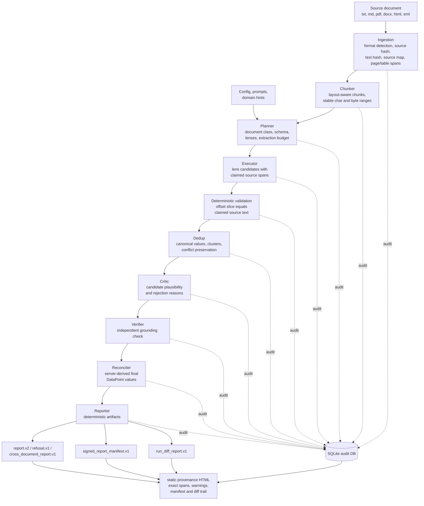

# Veritext Extractor

Veritext is a research-grade, domain-neutral document extraction engine for
high-stakes documents where every reported fact needs exact source provenance.
It treats LLMs as proposal generators, then uses typed contracts, deterministic
checks, and an SQLite audit trail to preserve source spans, schema identity,
rejections, and report integrity.

The system is optimized for extraction accuracy, auditability, and invariant
enforcement. Speed, cost, and convenience are secondary.

## End-to-End Flow



## What Makes It Different

- Mechanical provenance: extracted spans must round-trip to exact source text
  by character and byte offsets.
- Typed stage boundaries: Pydantic v2 models with strict validation keep
  inter-stage contracts explicit.
- Forced structured LLM calls: every LLM call routes through
  `src/extractor/llm/client.py`; free-text JSON parsing is not allowed.
- No silent drops: rejected candidates are logged with reason codes.
- Audit-first runtime: source documents, chunks, LLM calls, candidates,
  rejections, stage states, manifests, and integrity events are persisted in
  SQLite.
- Reporter-side provenance: static HTML artifacts are local deterministic files,
  not a web UI, server, REST API, browser app, or alternate extraction path.

## Supported Inputs and Outputs

Supported source formats:

- `.txt`, `.text`
- `.md`, `.markdown`
- `.pdf`
- `.docx`
- `.html`, `.htm`
- `.eml`

Primary output artifacts:

- `report.v2`: deterministic extraction report with ordered `DataPoint`
  records.
- `refusal.v1`: audited schema-fit refusal when the document is out of scope.
- `cross_document_report.v1`: grouped cross-document facts and conflicts.
- `signed_report_manifest.v1`: report/source/text/schema/prompt/config hashes
  plus signature metadata.
- `run_diff_report.v1`: deterministic diff between two extraction reports.
- Static provenance HTML: local reviewer artifact built from a report, audit DB,
  and optional manifest/diff inputs.

## Setup

Use Python 3.11 or newer.

```bash
python3 -m pip install -e .
cp .env.example .env
```

Keep secrets in `.env`. Provider and model settings belong in YAML config:

- `config/default.yaml` is canonical.
- `config/local.yaml` may override local runs.
- Environment variables may provide secrets such as `ANTHROPIC_API_KEY`,
  `OPENAI_API_KEY`, `MOONSHOT_API_KEY`, or `REPORT_SIGNING_KEY`.

The default config uses Anthropic. OpenAI and OpenAI-compatible providers are
also supported, but every structured model call still goes through the same LLM
client boundary.

After copying `.env.example`, set `ANTHROPIC_API_KEY` for the default config or
override `llm.provider` in `config/local.yaml` and set the matching provider key.

## Run an Extraction

```bash
veritext path/to/document.pdf \
  --output .veritext/reports/run-1.report.json \
  --run-id run-1 \
  --domain-hint legal_contracts
```

Resume an interrupted audited run with the same run ID:

```bash
veritext path/to/document.pdf \
  --output .veritext/reports/run-1.report.json \
  --run-id run-1 \
  --resume
```

The CLI prints a JSON summary with run ID, document ID, output path, output hash,
data point IDs, audit DB path, and usage totals.

## Inspect Audit State

```bash
veritext-audit .veritext/audit.sqlite3 --run-id run-1 --details
```

Without `--run-id`, the audit CLI inspects the latest run. With `--details`, it
includes LLM calls, candidates, critic/verifier reports, rejections, and final
data points.

## Sign, Diff, and Render Provenance

Write a detached signed manifest:

```bash
veritext-report sign \
  .veritext/reports/run-1.report.json \
  --audit-db .veritext/audit.sqlite3 \
  --manifest-output .veritext/reports/run-1.report.manifest.json
```

Verify a report against a manifest:

```bash
veritext-report verify \
  .veritext/reports/run-1.report.json \
  .veritext/reports/run-1.report.manifest.json
```

Write a deterministic report diff:

```bash
veritext-report diff \
  .veritext/reports/run-1.report.json \
  .veritext/reports/run-2.report.json \
  --diff-run-id run-1-vs-run-2 \
  --output .veritext/reports/run-1-vs-run-2.diff.json
```

Render a local static provenance artifact:

```bash
veritext-report provenance \
  .veritext/reports/run-2.report.json \
  --audit-db .veritext/audit.sqlite3 \
  --manifest .veritext/reports/run-2.report.manifest.json \
  --diff .veritext/reports/run-1-vs-run-2.diff.json \
  --output .veritext/reports/run-2.provenance.html
```

The provenance command writes a deterministic HTML file and prints a JSON
summary with the output hash, byte length, data point count, and warning count.
Warnings are intentional: missing audit text, absent optional trail inputs, and
source-span mismatches are rendered explicitly rather than repaired silently.

## Evaluations

Score one report against one fixture:

```bash
veritext-eval \
  evals/fixtures/minimal_financial_update/expected.json \
  evals/fixtures/minimal_financial_update/report.example.json
```

Score a suite:

```bash
veritext-eval --suite path/to/suite.json
```

Additional suite modes cover adversarial fixtures, mutation checks, and
calibration output.

## Development Checks

Run the standard gates before closing substantial work:

```bash
make test
make lint
make smoke
git diff --check
```

For prompt-neutral work, also verify that prompt files did not change:

```bash
git diff --exit-code -- prompts
```

## Repository Map

| Path | Purpose |
|---|---|
| `src/extractor/ingestion/` | Format-specific ingestion and source mapping. |
| `src/extractor/chunker/` | Boundary-preserving chunk construction. |
| `src/extractor/planner/` | Schema planning, domain-pack reuse, and refusal policy. |
| `src/extractor/executor/` | Lens execution and candidate materialization. |
| `src/extractor/critic/` | Candidate critique and rejection reasons. |
| `src/extractor/verifier/` | Independent source-grounding verification. |
| `src/extractor/reconciler/` | Data point materialization and cross-document grouping. |
| `src/extractor/reporter/` | JSON reports, signing, diffs, and static provenance artifacts. |
| `src/extractor/audit/` | SQLite audit store, inspection, and integrity state. |
| `src/extractor/contracts/` | Pydantic stage and artifact contracts. |
| `config/` | Runtime configuration and domain packs. |
| `prompts/` | Human-maintained prompt files and structured output contracts. |
| `evals/` | Source-backed fixtures, reports, and suite manifests. |

## Design Rules

The runtime must remain domain-neutral. Do not add document-specific tokens,
named entities, industry nouns, or fixture-specific patches to pass one example.
Design changes should be expressed as reusable extraction, provenance, schema,
reconciliation, audit, or invariant rules.
