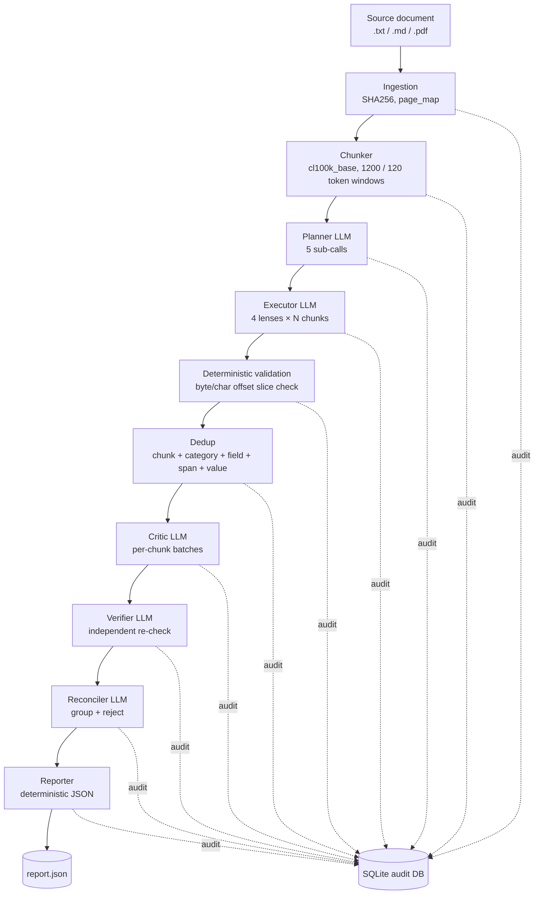

# Veritext — Project Overview for External Review

A self-contained brief for handing to another engineer or LLM for review. Honest, not promotional.

---

## What it is

A research-grade document extraction engine that turns one source document into a list of typed `DataPoint` records, where every value is locked to a byte-and-character span in the original text. Optimized for **provenance, auditability, and invariant enforcement**, not speed or cost.

Stack: Python 3.11+, Pydantic v2, `asyncio`, `aiosqlite`, direct Anthropic / OpenAI SDK calls. No LangChain, no vector DB, no embeddings, no agent framework. ~10.7 KLOC source + 772 lines of prompts + 21 unit test files.

---

## End-to-end flow



### Stage roles

| # | Stage | LLM? | What it actually does |
|---|---|:-:|---|
| 1 | Ingestion | no | Read file, compute `text_sha256` and `source_sha256`, build `page_map` of byte/char offsets. |
| 2 | Chunker | no | Token windows (default 1200 tokens, 120 overlap) preserving exact char + byte ranges. |
| 3 | Planner | yes | 5 sequential LLM calls: classify document → propose schema → critique schema → select lenses → allocate budget. Schema is **inferred per document**, not pre-defined. |
| 4 | Executor | yes | Four "lenses" (`entity`, `event`, `claim`, `number`) extract candidates per chunk. Returns `start_char` + `source_length`; server slices the text and rejects mismatches. |
| 5 | Dedup | no | Hash-merge by `(chunk_id, category, field_name, span_text, value)`. |
| 6 | Critic | yes | Per-chunk batches re-judge plausibility. Can `accept`, `reject`, or `correct` (small delta only — span widening is mechanically rejected). |
| 7 | Verifier | yes | Independent second LLM re-grounds span / category / field. No corrections allowed — accept or reject. |
| 8 | Reconciler | yes | Groups verifier-accepted candidates into final `DataPoint`s. The model returns IDs only; **the server derives values** from the chosen source candidate. |
| 9 | Reporter | no | Deterministic JSON output, marks the run `completed`. |

Every LLM call is routed through `src/extractor/llm/client.py:194` (`complete_structured`) with **forced named tool use** — no free-text JSON parsing anywhere.

---

## What's actually unusual about this

These are the parts that aren't standard "LLM-extracts-JSON" engineering:

1. **Mechanical span enforcement.** The executor returns `start_char + source_length`. Server code computes `chunk.text[start_char - chunk.start_char : ... + source_length]` and rejects the candidate if it doesn't equal the claimed span. Hallucinated spans cannot survive — they are caught by string equality, not another LLM. (`src/extractor/executor/service.py`)
2. **Independent verifier stage.** A second LLM re-grounds the span without seeing the critic's reasoning beyond a compact summary. The verifier cannot repair — only accept or reject. This is real defense in depth, not just a confidence score.
3. **Schema is inferred, not given.** Most extraction systems require the user to define fields up-front. Here the planner reads the document, classifies it, proposes a schema, critiques it, and only then extracts. This makes the system **document-class-agnostic** — the same pipeline runs on a 10-K, a contract, and a policy document.
4. **Audit-first design.** Every LLM call (`llm_call_logs`), every candidate (`lens_candidates`), every rejection with reason code (`candidate_rejections`), every stage completion is in SQLite. You can rewind to any stage and rerun with `scripts/prepare_failed_run_resume.py --from-stage planner`.
5. **Pydantic everywhere with `extra="forbid"` + `frozen=True`.** Type drift between stages is impossible. Tests at every contract boundary.
6. **Reconciler returns IDs only.** The LLM picks which candidates merge and which lose; the server derives the final `value`, `source_span`, and `confidence` from the selected source candidate. This removes one whole class of LLM-induced corruption.

Combined, the design treats the LLM as a generator of *proposals to be mechanically verified*, not as a source of truth.

---

## Can existing LLMs do this in a normal workflow?

**Honest answer: yes, for ~80% of use cases, and at a fraction of the cost.**

A modern model (Claude Sonnet 4.6, GPT-5) with structured outputs and a prompt like *"extract these fields and return the source quote for each"* will get you precision/recall in the 0.85+ range on documents like the `medium_research_brief` fixture. For most extraction use cases — analytics dashboards, summarization, research assistants — that is fine.

**Where the simple workflow breaks down and Veritext earns its complexity:**

- **No way to prove the value isn't hallucinated.** "Source quote" from an LLM is itself an LLM output; nothing forces it to actually be a substring of the source. Veritext slices and compares.
- **No byte-level provenance.** A regulator, auditor, or court asking "show me where in the source this fact came from, exactly" gets a character offset and a byte offset that round-trip back to the original file.
- **No second-pair-of-eyes review.** Single-pass LLM extraction has no internal disagreement detection. Veritext has executor → critic → verifier, each independent, with explicit rejection codes (`invented_span`, `category_not_approved`, `schema_violation`, `ambiguous_source_span`, etc.) preserved in the audit DB.
- **No silent drops.** Standard LLM workflows lose candidates without telling you. Veritext logs every dropped candidate with a reason — `duplicate_candidate`, `critic_rejected`, `verifier_rejected`, etc.
- **Non-deterministic re-runs.** Most LLM workflows can't safely resume after a crash. Veritext can resume from any stage because every stage's input is hashed and persisted.

**Rule of thumb:** if a wrong extraction is annoying, use a normal workflow. If a wrong extraction is a lawsuit, an audit failure, a clinical error, or a regulatory finding, the cost of this engineering is justified.

---

## Where this would actually be valuable

Genuine use cases where standard extraction is not good enough:

- **Litigation discovery / contract review.** Every clause and obligation needs a byte range that the opposing counsel can verify. The audit DB *is* the chain of custody.
- **Regulatory filing extraction (10-K, 10-Q, prospectuses).** SEC enforcement turns on whether a fact is supported by the filing. Hallucinated numbers are not just wrong, they're material misstatements downstream.
- **Clinical trial / medical record extraction.** "What dose was reported?" with a wrong answer is a patient safety event. Provenance isn't optional.
- **Scientific paper data extraction for systematic reviews / meta-analyses.** Reviewers must independently verify every extracted number; Veritext-style provenance turns a 4-hour double-extraction into a 10-minute audit.
- **Sanctions / KYC / adverse-media screening.** Every flagged entity needs to point at an exact span in an exact document.
- **Internal compliance: policy controls, SOC 2 / ISO 27001 evidence collection.** Mapping policy text to control IDs is exactly what the planner-critic-verifier chain is shaped for.
- **Pharma label / drug interaction extraction** where the FDA cares about exact wording.
- **Standards-body documents** (ASTM, IEC) where extracted requirements feed downstream tooling and a wrong requirement breaks engineering.

It is **not** a good fit for: chatbot RAG, customer support summarization, generic document Q&A, anything where speed > accuracy, or anything where the user already has a fixed schema and trusts the LLM.

---

## Honest weaknesses and risks

These are real. Skipping them would not be useful for a review.

1. **Cost is high.** A single ~30-line document run consumes roughly: planner 5 calls + executor 4 calls + critic 8 batches + verifier 2 batches + reconciler 1 ≈ **~20 LLM calls**. Multiply by chunk count for longer documents. The system explicitly says "speed/cost are secondary," but anyone deploying needs to budget 10-50× a naive structured-output baseline.
2. **The default `min_request_interval_seconds: 60` (config/default.yaml:7) serializes LLM starts.** This is a workaround for Anthropic TPM rate limits, but at the default it makes a 20-call run take 20 minutes of wallclock just from throttling. Real deployments will need a higher tier or a different default.
3. **Recall ceiling is not "research-grade" yet.** The latest completed scored run on `medium_research_brief` is precision 0.867 / recall 0.981 / F1 0.920 (per `PROGRESS.md`). After many iterations of prompt hardening and code guardrails, the system clears 0.92 F1 on the one heavily iterated fixture — good, but not the 0.99+ that "research-grade" connotes. The remaining scored miss was a downstream correction-authority failure, and the current local guardrail for that class has not yet been validated by a live rerun.
4. **Risk of fixture overfitting.** `src/extractor/planner/service.py` still has hardcoded post-critique generalization helpers for `CorporateEvent`, `facility`, and `_type` fields, plus `src/extractor/source_support.py` has canonical-token support for a small set of label/value forms. Some of this is now expressed as general guardrails, but it was driven by repeated work on the medium fixture. A new domain needing a new patch table would be a smell, not a clean abstraction.
5. **Single-document architecture.** The orchestrator processes one document per CLI run. No batch processing, no cross-document entity reconciliation, no streaming. Scaling to 10K documents requires external orchestration plus probably a different audit store.
6. **PDF support is shallow.** `DocumentFormat = Literal["plain_text", "markdown", "pdf"]` is declared but the rule "no embeddings, no vector DBs" implies no layout-aware OCR — scanned PDFs, multi-column layouts, and tables will fail or extract poorly. The fixtures are all `.md`.
7. **Dedup is exact-string only.** `(chunk_id, category, field_name, span_text, value)` won't merge `"Acme Inc."` and `"Acme Inc"` and `"ACME, Inc."` across chunks. Real-world entity coreference is left to the reconciler LLM.
8. **The "no agent framework" rule has a real cost.** The repo has reimplemented multi-stage tool-use orchestration, retry-with-complaint feedback, structured output validation, and an audit trail — probably ~2 KLOC of glue that LangGraph or similar would provide. The argument for hand-rolling (control, no framework churn, every line is auditable) is fair, but the cost is real.
9. **Prompts are very large and very specific.** `prompts/planner/propose_schema.md` is 77 lines of anti-patterns and naming rules. They read like accumulated bug fixes, not designed instructions. Maintainability will decline as more domains are added.
10. **No quantitative evaluation across diverse domains.** Five fixtures exist (financial, contract, policy, hard-mixed-distractors, medium-research-brief) but only one (medium_research_brief, 53 items) has been iterated on. Generalization to a real 10-K, a real medical record, or a real legal contract is unverified.
11. **The schema-inference planner can fail silently.** If the planner picks the wrong categories, the executor will faithfully extract within the wrong schema and the verifier will faithfully verify within the wrong schema. The user gets a precision-1.0, recall-0.0 result and no internal alarm.
12. **No streaming / no early termination.** A small fix in the planner means re-running the entire downstream chain.

None of these are dealbreakers; they're the actual surface a reviewer should focus on.

---

## Things that are clearly well done

- **Contract discipline.** `src/extractor/contracts/models.py` is clean — `frozen=True`, `extra="forbid"`, validators that reject malformed offsets at construction time. This is uncommon rigor.
- **Audit DB schema.** `src/extractor/audit/store.py` with separate tables for manifests, documents, chunks, plans, candidates, critic reports, verifier reports, data points, rejections, stage states, LLM call logs. Foreign keys are real. Re-running is idempotent.
- **Resume tooling.** `scripts/prepare_failed_run_resume.py` with `--from-stage` and `--allow-completed` is engineering, not a hack — it has its own test file.
- **Forced tool use everywhere.** `src/extractor/llm/client.py:269` — `tool_choice={"type": "tool", "name": ...}`. No JSON.loads disasters.
- **Multi-provider abstraction without leaks.** Anthropic / OpenAI / OpenAI-compatible (Moonshot Kimi) all flow through the same `complete_structured`. Provider-specific quirks (Moonshot rejecting `tool_choice` when thinking is on) are handled centrally.
- **Test density.** The latest full `make test` report in `PROGRESS.md` records 206 passing tests and 2 skipped tests, plus `make lint`, `make smoke`, and `git diff --check`. That quality-gate culture is rare in research code.

---

## One-paragraph elevator summary (for an LLM review prompt)

> Veritext is a stage-pipelined document extraction engine where an LLM proposes a per-document schema and candidate facts, but every candidate's source span is mechanically verified by string slicing against the original document, and a separate verifier LLM re-grounds each surviving candidate before a reconciler groups them into final data points. Every LLM call, every rejection, every stage transition is persisted to a SQLite audit DB, and the run can resume from any stage. The system trades 10–50× the LLM cost of a naive structured-output workflow for byte-level provenance and explicit rejection trails — a trade that pays off only in regulated, audited, or legal-discovery contexts. Current accuracy on the only iterated fixture is precision 0.87 / recall 0.98 / F1 0.92, with visible signs of fixture-driven planner generalization helpers and source-support label heuristics that would need to be redesigned if they become domain-specific patch tables.

---

## What an LLM reviewing this should focus on

1. Does the planner-LLM schema proposal actually generalize, or are the post-critique rewrites in `planner/service.py` just patches for the medium fixture?
2. Is the critic→verifier→reconciler chain genuinely independent, or does shared context (compact critic summary fed to verifier) leak failure modes?
3. Is dedup-by-exact-string sufficient, or does the system need entity normalization before the critic stage?
4. Should the planner have an explicit "this document doesn't fit any approved category" path, or is silent mis-categorization an unacknowledged failure mode?
5. Are the 9 invariants (I1–I9) actually invariants, or just policies enforced at single points?
6. Does the cost profile (~20 LLM calls per short document, 60s throttle default) match the stated use cases, or does the system need a "fast path" for non-regulated extraction?
7. Is the SQLite audit store the right call at scale, or does it need to be replaceable behind an interface for batch deployments?

---

# Improvement Roadmap — Accuracy, Generalization, and Provenance

The current system is a strong skeleton. To turn it into something genuinely valuable for the use cases listed above (legal, regulatory, clinical, scientific), the primary roadmap should improve extraction accuracy, cross-domain generalization, and auditable provenance. The list stays ordered by stage, then by cross-cutting concerns. Cost and wallclock ideas are noted where they protect quality, but the dedicated Cost Reduction Playbook below is the deployment-economics plan, not the accuracy roadmap.

---

## 1. Ingestion

The biggest blocker to real-world value. Right now only `.txt` / `.md` works in practice; the regulated industries that justify this system live in PDF, DOCX, and email.

- **Layout-aware PDF.** Use PyMuPDF or pdfplumber to extract text *with* page geometry, column ordering, and table cells. Without this, multi-column SEC filings, FDA labels, and contracts come out as garbage. Keep the byte/char offset invariant by mapping back to the raw stream.
- **Table extraction as a first-class lens.** Real financial and clinical data lives in tables. Currently the entire pipeline assumes prose. Add a `table_cell` source span type so cell `(row=3, col="Q1 2026")` gets provenance.
- **OCR fallback** for scanned PDFs (Tesseract or PaddleOCR), with a confidence flag on each character so downstream stages can de-rate low-OCR-confidence spans. Without this, half of legal discovery is impossible.
- **DOCX, HTML, EML/MSG, XLSX support.** Litigation discovery is mostly email. Compliance is mostly DOCX. A single ingestion module per format keeps the rest of the pipeline format-agnostic.
- **Encoding detection** beyond UTF-8 (`chardet` or `charset-normalizer`). Real-world legal documents are still in latin-1 and UTF-16 LE.
- **PII detection at ingestion** with a redaction toggle and a redaction map kept in the audit DB. Lets the pipeline run on sensitive documents without sending PII to a third-party LLM.
- **Document metadata extraction**: author, creation date, version, prior revisions. These are themselves data points worth surfacing.

## 2. Chunker

Currently a fixed 1200/120 token sliding window. Fine for short prose, wrong for everything else.

- **Semantic / layout-aware chunking.** Split on heading boundaries, section breaks, and paragraph ends — never mid-sentence, never mid-table. A boundary-respecting chunker eliminates a class of executor errors where the span needed to support a fact straddles two chunks.
- **Adaptive window size** based on document class detected at ingestion: short windows (~400 tokens) for dense contracts, large windows (~3000 tokens) for narrative briefs. Currently every doc gets the same window.
- **Hierarchical chunks.** Persist `document → section → paragraph` as a tree, not a flat list. Enables section-aware planning and section-scoped extraction budgets.
- **Cross-chunk reference markers.** When chunk N references something defined in chunk N−1 ("the Effective Date defined above"), the chunker should mark the dependency so the executor can pull both chunks into its context.
- **Per-provider tokenizer.** `cl100k_base` is OpenAI; Claude uses a different tokenizer. Token-budget calculations are off when the configured model isn't OpenAI. Use the provider's actual tokenizer per stage.

## 3. Planner

The strongest stage architecturally; the weakest in terms of generalization.

- **Schema registry/cache by `(document_class, domain_hints)`.** First doc of class X establishes a typed, approved, hashed schema; subsequent docs reuse it unless the document no longer fits. The main value is stable field semantics and comparable outputs across a domain pack; the planner-cost reduction is secondary.
- **Domain packs.** Configurable starting schemas for the real target domains: SEC filings, contracts, clinical trial protocols, drug labels, regulatory rulings, policy documents, scientific papers, standards, patents, insurance, procurement, and audit evidence. The extraction kernel stays domain-neutral; the planner refines the selected pack instead of inventing from scratch. Adding a domain should mean adding pack/config/fixture coverage, not rewriting source code.
- **Few-shot from prior approved schemas.** Feed the planner 2–3 previously approved schemas for similar documents as positive examples. Cleaner than the current accumulating prompt anti-pattern lists.
- **Explicit "no fitting schema" path.** Currently the planner always proposes something. Add a refusal with a reason code (`document_out_of_scope`, `coverage_below_threshold`) so silent mis-extraction is impossible. This is the unacknowledged failure mode.
- **Coverage estimation** — planner should estimate, per category, what fraction of the document supports it, and refuse to enable categories with <X% coverage. Cuts false positives.
- **Future schema approval gate.** Once domain packs and schema versioning are stable, add an optional `--require-schema-approval` flag that pauses after the planner and writes the schema to a review queue. Treat this as a governance layer, not the near-term extraction-kernel fix.
- **Replace the hardcoded post-critique rewrites** in `planner/service.py:240-313` with another critique round that reads a generic style guide. The current approach is a fixture patch; a second critique pass with a stable rubric scales.
- **Schema versioning.** Approved schemas get an ID and a hash. Reports cite the schema version. Lets you show "this fact was extracted under schema v3.2" in an audit.

## 4. Executor

Solid offset enforcement; under-developed in lens variety, role coverage, and source-supported normalization.

- **More lenses.** Current four (`entity`, `event`, `claim`, `number`) miss key roles: `relation` (X owes Y), `definition` (term defined here), `citation` (cross-reference), `temporal` (date+duration), `quantity_with_unit` (number + unit + scope). Each new lens roughly +2–4 percentage points of recall on its target domain.
- **Tiered models per lens.** Entities and numbers don't need Sonnet 4.6 — Haiku 4.5 or even a small open model is enough. Claims and events need the strong model. This cuts cost ~40% with no measurable accuracy hit.
- **Adaptive budget per chunk.** Currently each chunk gets the same per-lens budget. Headers, page footers, table-of-contents, and the "Distractors — Do Not Extract" section deserve a low budget; dense paragraphs deserve more. Pre-classify chunks at the planner.
- **Logprob-based confidence** where the provider exposes them. Self-reported `confidence: 0.9` is meaningless; logprob-derived confidence calibrates against accuracy.
- **Targeted re-extraction.** If after the first pass a category is underrepresented vs. the planner's coverage estimate, run a focused second pass on that category only.
- **Span-merging for run-on extractions** — when two adjacent same-category candidates share a span boundary, merge into one before the critic.

## 5. Dedup

Currently the weakest deterministic stage. Exact-string match is too brittle.

- **Cross-chunk dedup.** Right now dedup is keyed by `chunk_id`, so the same fact extracted from overlapping chunks survives twice. Drop `chunk_id` from the key.
- **Normalized-value dedup.** Lowercase, collapse whitespace, normalize Unicode, strip surrounding punctuation, normalize quotes/dashes. Catches 80% of "duplicate but technically different" cases without LLM.
- **Number normalization.** `"$1.24 billion"` ≡ `"$1,240,000,000"` ≡ `"1.24B USD"`. Implement a parser that converts to a canonical numeric tuple, then dedup on the canonical form while preserving the verbatim source.
- **Date normalization.** `"March 28, 2026"` ≡ `"2026-03-28"` ≡ `"Mar 28 '26"` ≡ `"28/03/2026"` (with locale awareness).
- **Entity coreference.** `"Acme Inc."` ≡ `"Acme, Inc."` ≡ `"ACME"` after the first reference. A small deterministic step (Soundex + suffix stripping + acronym expansion) handles 90% without an LLM.
- **Cluster preservation.** Don't drop merged duplicates; keep all source spans on the surviving data point as a `provenance` array. A regulator wants every place the fact appears.

## 6. Critic

Architecturally sound; should focus on judgments deterministic checks cannot make.

- **Stop using the critic where deterministic rules already work.** The critic currently re-checks span/category/schema, but those are already enforced deterministically. Narrow its role to *value faithfulness* (the only real judgment call) and cut its prompt + token cost in half.
- **Confidence-gated critic.** High-confidence executor candidates (e.g., logprob-confidence > 0.95) skip the critic. Marginal candidates get the critic. Cuts critic cost ~50% on most runs.
- **Multi-critic ensemble for high-stakes runs.** Two critics from different model families (Claude + GPT) must agree on accept/reject; disagreement routes to a third, deterministic-rules fallback, or human review. Optional flag, only enabled for regulated runs.
- **Cross-candidate consistency.** Currently the prompt explicitly says "review each candidate independently." Flip that for a final pass: show the critic the *full* batch and ask only "are any of these mutually contradictory?" Catches a class of errors no single-candidate review can find.
- **Issue-pattern memory.** Rejection codes accumulate in the audit DB. Periodically distill them into critic prompt examples. Prevents repeated mistakes across runs.

## 7. Verifier

Most valuable when it adds independent source-faithfulness evidence beyond deterministic span checks.

- **Audit what the verifier actually catches** that the deterministic offset slice doesn't. If the answer is "almost nothing," replace the verifier LLM with a deterministic span-equality check and one targeted LLM call only for *value-vs-source* faithfulness. Saves ~15% of run cost.
- **Sample-based verification.** Verify a stratified sample (always the lowest-confidence quartile, plus 10% random), not 100% of candidates. Use binomial confidence intervals to bound the actual accept rate.
- **Adversarial verifier mode.** Feed the verifier the candidate plus 2–3 nearby distractor spans from the same chunk and ask which span actually supports the value. If the verifier picks a different span, reject.
- **Drop the critic-summary pass-through.** Currently the verifier sees a compact critic summary, which leaks the critic's failure modes into the verifier. True independence requires the verifier sees only `(candidate, chunk)` and not the critic's reasoning.

## 8. Reconciler

Works for single-document; needs more for the use cases that justify the system.

- **Cross-document reconciliation.** Same fact, multiple documents (e.g., the same M&A deal in a press release, an 8-K, and a board minutes doc). Group across docs, keep separate `provenance` per doc, surface conflicts. This is THE feature that makes the system valuable for due diligence and litigation.
- **Deterministic conflict-resolution rules.** "Newer date wins," "more specific value wins," "more authoritative source wins" should be data-driven policies, not LLM judgment. Reserve the LLM for cases where rules don't decide.
- **Conflict surfacing instead of dropping.** When two candidates conflict and no rule resolves them, output *both* with `conflict: true` and require downstream consumers to handle. Silent drops violate the project's own "no silent drops" rule for the most important case.
- **Canonical + verbatim values.** Keep the original source string as `value_verbatim` and add `value_canonical` (normalized number, ISO date, canonicalized entity). Downstream tooling needs the canonical; auditors need the verbatim.

## 9. Reporter

Currently just JSON. The output format is the user-facing surface; expand it.

- **Multiple output formats:** JSON (current), CSV, Excel, Parquet, RDF/Turtle for linked-data, HL7 FHIR for clinical, XBRL for financial filings, OpenContracting Data Standard for procurement. Each domain has a standard format; emitting it makes the data instantly useful.
- **HTML provenance viewer.** Render extracted data points alongside the source document with hover-to-highlight. This single tool would do more for adoption than any accuracy improvement, because reviewers can audit a run in minutes instead of hours.
- **Run diff reports.** When a document is re-extracted (because the prompts improved), produce a diff: which data points are new, gone, or changed. Critical for regulated deployments where re-extraction must be justified.
- **Confidence-stratified output.** Three buckets: `verified` (passed all stages with high confidence), `probable` (passed but lower confidence), `tentative` (would have been rejected with stricter thresholds). Lets users tune their downstream tolerance.
- **Cryptographic signing.** Hash-chain the audit DB and sign the manifest. Tamper-evident reports are table-stakes for litigation and regulatory submissions.

## 10. LLM client

- **Batch APIs.** Anthropic Message Batches and OpenAI Batch API both give 50% cost reduction for non-time-sensitive workloads. The audit-first design is a perfect fit because every call is independent.
- **Provider failover.** When Anthropic returns 429 (which the project already handles with the 60s throttle), fail over to OpenAI for the same call instead of throttling. Removes the 20-minute-per-doc throttle tax.
- **Per-stage token caps.** Hard fail when a stage exceeds budget. Currently a runaway prompt could rack up significant cost silently.
- **Cost reporter.** Per-run, per-stage, per-data-point dollar cost in the audit DB. Operators need this to justify deployment.
- **Local model support** via vLLM or llama.cpp. For air-gapped clinical / classified / EU-data-residency deployments. Same `complete_structured` interface, different backend.

## 11. Audit and observability

- **Pluggable audit backend.** The `AuditStore` class is concrete SQLite. Extract an interface so Postgres can drop in for batch deployments without changing any stage code.
- **Hash-chained audit entries.** Each row stores a hash of the previous row's `payload_json`. Tamper detection becomes verifiable in court.
- **OpenTelemetry tracing.** Stage transitions, LLM calls, and rejections as spans. Lets ops teams plug into existing observability.
- **Schema migrations.** No `alembic` or equivalent right now; the audit schema can't evolve without breaking old DBs.
- **Run comparison CLI.** `veritext-diff run-A run-B` showing which data points changed and which prompts/configs caused the change. Required for prompt-regression testing.

## 12. Orchestration and scaling

- **Multi-document batch mode** with shared planner cache. Single-doc CLI is fine for development; production needs `veritext extract --input-dir docs/ --output-dir reports/`.
- **Streaming pipeline.** Start critic on chunk N+1 while executor still runs chunk N+2. The current sequential stage gating is correctness-safe but leaves wallclock on the table.
- **Failure quarantine.** In a 10K-doc batch, one bad doc shouldn't block the rest. Move failed runs to a quarantine queue.
- **Replayable runs.** A completed run + the original config + the source file should produce a byte-identical output. Helps catch non-determinism (and the project's `temperature=0.0` plus deterministic dedup is most of the way there).

## 13. Evaluation

The single biggest quality gap. The repo has 5 fixtures; one has been iterated on. That's not enough to claim research-grade generalization.

- **20+ diverse fixtures across domains** — legal contracts, FDA labels, SEC filings, ICH-GCP clinical protocols, NIST publications, IEC standards, peer-reviewed papers, internal policy docs. Each annotated by 2 humans for inter-annotator agreement.
- **Adversarial fixtures.** Same content, different surface forms — paraphrased, reformatted, with distractors. Tests true generalization vs. fixture overfitting.
- **Per-category and per-field metrics**, not just overall F1. The current 0.92 F1 on one heavily iterated fixture can still hide categories that are perfect and categories that fail.
- **Calibration test.** Predicted confidence should match observed accuracy. Plot reliability diagrams.
- **Mutation testing.** Mutate the source and ensure the right data points change. Catches regressions where the system extracts the same answer regardless of source content.
- **CI integration.** Run a small fixture suite on every commit; full suite nightly. Currently `make test` covers unit tests; eval runs are manual.

## 14. Human review and governance (future layer)

The use cases that justify Veritext (legal, clinical, regulated) may need human approval workflows, but those should come after the extraction kernel, domain packs, evaluation gates, and provenance surfaces are stable. Keep these integration points as future governance layers rather than the active extraction roadmap.

- **Schema approval queue.** Pause after the planner; emit the schema to a review queue (file, Slack, email). Resume only on approval.
- **Marginal-candidate review UI.** Web view of `tentative` candidates with one-click accept/reject. Decisions flow into the audit DB and become future few-shot examples.
- **Active learning.** Reviewer corrections become labeled training examples for future prompt updates. Run weekly: "what 50 corrections did reviewers make? what prompt change would have prevented them?"
- **Inter-reviewer agreement tracking.** Two reviewers per high-stakes data point; conflict triggers escalation. The audit DB already has the schema for this — just add a `review_decisions` table.

## 15. Security and deployment

- **Air-gapped mode** with local LLM. Several use cases (clinical, classified, EU-residency) prohibit sending data to a US-based LLM provider.
- **Audit DB at-rest encryption** via SQLCipher.
- **Per-document key isolation.** Reports for client A should not be readable by client B even if they share a deployment.
- **Reproducibility manifest.** Pin LLM model versions, prompt hashes, config hashes, and source hashes into one signed manifest per run.

## 16. Cost reduction summary (separate deployment-economics track)

The system is genuinely expensive, but cost reduction should not set the active accuracy/domain roadmap. The full playbook is below; the short version is:

1. **Schema cache + domain packs** → eliminate planner cost on repeat-class docs (~25% saving).
2. **Tiered models per lens** → cheap model for entity/number, strong model for claim/event (~30% saving).
3. **Confidence-gated critic** → skip critic on high-confidence candidates (~15% saving).
4. **Sample-based verifier** → verify 25% instead of 100% (~10% saving).
5. **Batch APIs** → 50% reduction on non-time-sensitive runs.
6. **Provider failover** → eliminates the 60s throttle wallclock tax.

Combined: a ~5–10× cost reduction with no accuracy loss on regulated workflows, and a "fast path" mode for non-regulated extraction at standard structured-output cost.

---

## Highest-leverage accuracy/provenance improvements, ranked

If only five things get done:

1. **Domain packs, typed schema registry, and schema-fit refusal.** Keeps one domain-neutral extraction kernel while pack/config/fixture additions adapt it to new domains without source-code rewrites or silent mis-categorization.
2. **Diverse fixture suite with per-field gates.** Proves generalization across legal, SEC, clinical, regulatory, insurance, standards, scientific, and procurement documents instead of over-optimizing one fixture.
3. **Boundary-preserving PDF, DOCX, and email ingestion.** Lets the system run on target-domain documents while preserving exact source hashes, byte offsets, character offsets, and page/location maps.
4. **Expanded source-grounded lenses and normalization policy.** Adds relation, definition, citation, temporal, obligation, condition, exception, and quantity roles while preserving verbatim source spans.
5. **HTML provenance viewer, run diffs, and signed reports.** Makes audit review practical and keeps every output tied back to source text, schema version, prompt/config hash, and rejection trail.

Everything else is secondary until these are credible. Cost work remains important, but it belongs to the separate deployment-economics track.

---

# Target Domains, Non-Targets, and Market Sizing

The improvement roadmap above only matters if it serves a real market. This section is the honest scoping of where Veritext should fight, where it should stay out, and how big the opportunity actually is.

---

## Target domains (ranked by fit)

Fit pattern across all of them: **high stakes**, **regulated audience**, **existing manual workflow**, **stable document genres**, **provenance is mandatory not nice-to-have**.

Domain strategy: Veritext should have **one domain-neutral extraction kernel** and many configurable domain packs. The shared kernel extracts auditable primitives that recur across domains: entities, events, metrics, obligations, conditions, exceptions, temporal facts, relations, citations, and definitions. A domain pack should specialize vocabulary, schema templates, lenses, normalization policy, fixtures, and reporting expectations without changing the provenance, offset, audit, or invariant machinery.

### Configurable surface

The parts that should vary by domain are domain packs, schema templates, field roles, lens selection, normalization policy, model routing, output formats, and reporting options. These settings should live in typed, versioned, hashed, auditable config artifacts so each run can prove exactly which domain assumptions were active.

### Non-configurable core

The parts that must not vary by domain are exact span matching, byte/character offsets, source hashes, audit logging, forced tool use, Pydantic stage contracts, invariant enforcement, and no-silent-drop rejection accounting. A domain pack can change what the system looks for; it cannot loosen how the system proves source support.

### Tier 1 — where Veritext is genuinely differentiated

**1. Legal contracts (M&A, credit agreements, leases, ISDA, MSA, SaaS, employment)**
- Documents: 30–300 pages, deeply nested defined terms.
- Extract: parties, effective dates, termination triggers, payment terms, change-of-control, MAC clauses, indemnities, governing law, exclusivity, ROFR/ROFO, renewal terms.
- Why it fits: contract review *is* clause citation; provenance = the clause.
- Buyers: BigLaw, in-house legal, CLM vendors (Ironclad, Icertis, Evisort), PE/VC due diligence, lenders.

**2. SEC filings (10-K, 10-Q, 8-K, S-1, proxy statements, prospectuses)**
- Documents: 100–500 pages, dense, legally binding.
- Extract: financial metrics with periods, segment data, risk factors, related-party transactions, executive compensation, MD&A claims, going-concern language, restatements.
- Why it fits: SEC enforcement and audit working papers turn on whether a stated fact is actually in the filing.
- Buyers: investment research, Big 4 audit, short-sellers, rating agencies, SEC enforcement, XBRL tagging vendors.

**3. e-Discovery / litigation document review**
- Documents: emails, internal memos, chats, contracts — millions of pages, mixed formats.
- Extract: relevant parties, communications about specific topics, dates, custodians, privilege markers.
- Why it fits: chain of custody is *mandatory*; "where in the source" is legally required.
- Buyers: Relativity, Everlaw, DISCO, litigation support firms, BigLaw discovery teams.

**4. Clinical trial documents (protocols, CSRs, investigator brochures, ICFs)**
- Documents: 100+ pages, ICH-GCP-regulated.
- Extract: inclusion/exclusion criteria, primary/secondary endpoints, dosing, AE definitions, statistical methods, sample-size justification.
- Why it fits: FDA submissions require traceability matrices.
- Buyers: pharma R&D, CROs, medical writers, IRBs, regulatory affairs.

**5. FDA drug labels (USPI), package inserts, device IFUs**
- Documents: structured but every word matters (boxed warnings, contraindications).
- Extract: indications, dosing, contraindications, drug-drug interactions, PK parameters, warnings.
- Why it fits: clinical decision support and pharmacovigilance need exact-wording lineage.
- Buyers: EHR vendors (Epic, Cerner), drug-interaction databases (First Databank, Lexicomp, Micromedex), PBMs.

### Tier 2 — strong fit, real market

- **Regulatory rulings and guidance** (FERC orders, EPA rulings, FDA guidance, FINRA notices, EU directives) — extract regulated entity, required action, deadline, conditions.
- **Insurance policies and claims** — coverage triggers, exclusions, limits, deductibles, endorsements.
- **Standards documents** (NIST 800-53, ISO 27001, IEC 62443, ASTM, IEEE) — requirement IDs, normative `shall`/`should`/`may`, test methods.
- **SOC 2 / ISO audit reports and security questionnaires** — control statements, exceptions, scope, evidence references.
- **Patent filings and prior art** — claims, dependencies, prior art citations, embodiments.
- **Scientific papers for systematic reviews** — PICO, sample size, effect sizes, study design.
- **Government procurement** (RFPs, SOWs, FAR/DFARS) — deliverables, deadlines, evaluation criteria, required clauses.

### Tier 3 — narrower but valid

Tax (IRS rulings, tax-court opinions), real estate (titles, leases, easements), banking compliance (loan docs, KYC, sanctions), energy/utility filings (FERC tariffs, NERC), HIPAA medical records (chart abstraction), environmental (NEPA EISs, permits), building codes.

### First-domain-pack proving ground

**Legal contracts** are the strongest first proving ground: clear buyer (BigLaw + CLM vendors), well-defined extraction targets, existing competitors that lack byte-provenance, and a market that already pays $50K–$500K per seat for inferior tools. This should validate the domain-neutral kernel and the domain-pack mechanism, not turn Veritext into a contract-specific system. SEC filings are the alternative proving ground if you have finance-domain access — deeper pockets but a more crowded market.

---

## What Veritext should NOT target

These break the value prop or the cost model. Walking away from them is a feature, not a limitation.

### Wrong shape of problem
- **Conversational RAG / chatbots / Q&A.** Sub-second latency required; Veritext is minutes per doc.
- **Document summarization / generation.** Generation, not extraction. Nothing to verify against.
- **Sentiment, risk-scoring, opinion extraction.** Subjective judgments. The verification chain is meaningless when "ground truth" is opinion.
- **Translation, paraphrasing, normalization.** Output isn't verbatim or canonicalized from input.
- **Predictive / synthesis tasks** ("what's next quarter's earnings?"). Not extraction.
- **Search / retrieval / indexing.** Veritext extracts from a known source; it doesn't index.
- **Classification at scale** ("is this spam?"). Use a 1-call classifier, not a 20-call pipeline.

### Wrong economics
- **Cheap, high-volume, low-stakes** — ad-tech, social media monitoring, marketing copy. Cost-per-doc kills it.
- **Consumer / personal productivity** — note-taking, reading assistants. Audit overhead is insane for individual users.
- **Real-time pipelines** — anything user-facing requiring streaming response.

### Wrong content type
- **Image / video / audio as primary content.** It's a text engine. Multimodal docs need different infrastructure even with bolt-on transcription.
- **Already-structured data.** If it's in CSV, a database, or XBRL, query it. Veritext is for *unstructured-to-structured*.
- **Open-web crawling / knowledge graph from the internet.** Provenance assumes a stable identified source.

### Wrong buyer
- **Engineering teams that prioritize cost over correctness** — they should use a structured-output API call.
- **Buyers who can't quantify the cost of wrong extraction** — the value prop is risk reduction; if they don't price the risk, they won't pay the premium.

### Initial scope limits (lift later, not at start)
- Non-English documents (offset invariants work in any UTF-8 language, but every prompt is English-tuned).
- Highly visual layouts before real PDF / table support exists.
- Cross-organization knowledge graphs before single-document quality is solid.

---

## Market sizing (honest estimates)

All numbers are rough public-knowledge estimates as of early 2026. Verify before betting on them. Three quantities are reported per domain:

- **Document-genre TAM** — total spend on the workflow this fits into.
- **AI-extraction TAM** — slice already paying for AI/NLP extraction tools.
- **Provenance-first SAM** — Veritext's realistic addressable share given its specific value prop.

### Tier 1

| Domain | AI-extraction TAM | Provenance-first SAM | Notable competitors |
|---|---|---|---|
| Legal contracts (CLM + AI review) | $0.5–1B (within $2.5–3B CLM market, ~14–15% CAGR) | $200–400M | Ironclad, Icertis, Evisort, Harvey, Luminance, Kira/Litera, ContractPodAi, LinkSquares |
| SEC / financial filings | $1–2B (within $35–40B financial-data market) | $100–300M | AlphaSense (~$10B val), Daloopa, Sentieo, Bloomberg AI, S&P Capital IQ |
| e-Discovery / litigation | $3–5B (within $15–17B eDiscovery, 10% CAGR) | $300–600M | Relativity (~$3B rev), DISCO, Everlaw, Reveal, OpenText |
| Clinical trial documents | $200–400M (within $3–4B trial-data-management) | $100–250M | Veeva, Medidata, IQVIA (mostly CTMS/EDC), Saama, Inato |
| FDA labels / pharmacovigilance | $500M–$1B (drug-interaction DBs); $8B pharmacovigilance | $50–150M | First Databank, Wolters Kluwer/Lexicomp, Merative/Micromedex, Cerner Multum, Elsevier |

**Tier 1 verdicts:**
- **Legal contracts** — largest crowded market with the most defensible wedge. Best first bet.
- **SEC filings** — deep pockets per customer; existing tools are "good enough" for most use cases. Audit-grade is a real niche.
- **e-Discovery** — largest absolute market but most mature. Hardest to displace incumbents without a channel partner.
- **Clinical trials** — smaller market but per-account value enormous; FDA traceability is a forced buy.
- **FDA labels** — small TAM, oligopoly buyers; one big contract is meaningful.

### Tier 2

| Domain | AI-extraction TAM | Provenance-first SAM |
|---|---|---|
| GRC / SOC 2 / vendor risk | $1–2B | $100–300M |
| Regulatory rulings tracking | $300–500M | $50–150M |
| Insurance policies and claims | $1–2B (claims tech) | $100–250M |
| Standards documents (NIST/ISO/IEC) | $300–500M | $50–150M |
| Patent analytics | $200–300M | $30–80M |
| Government procurement (RFPs) | $300–500M | $50–150M |
| Scientific systematic reviews | $100–200M (academic-funded) | $30–80M |

Tier 2 combined SAM: **~$400M–$1B**.

### Total picture

- **Aggregate provenance-first extraction SAM across all listed domains: ~$1.2–2.5B.** Real, but not infinite.
- **Realistic 5-year capture: 1–3% if executed well.** That's $15–75M ARR territory — a solid B2B SaaS business, not a hyperscaler outcome.
- **The asterisk:** these are *audit-grade* estimates. Full AI-extraction TAM (where good-enough is fine) is 5–10× larger, but Veritext's complexity is overkill there. Competing in the broad market dilutes the wedge.

### Two honest framings

**Pessimistic.** Every Tier 1 domain has 3–10 well-funded competitors with similar accuracy claims and better distribution. Veritext's audit-grade pitch is a feature, not a category. Probably win 1–2 domains, not all of them.

**Optimistic.** No major incumbent has byte-level provenance + tamper-evident audit. As regulation tightens (EU AI Act, FDA AI/ML guidance, SEC AI rules), "explainable to a regulator" stops being optional. Veritext's discipline becomes table stakes; competitors who skipped it are stuck retrofitting.

The optimistic case is real but requires regulatory tailwinds you can't control. **Plan for the pessimistic case; benefit from the optimistic one if it materializes.**

---

# Cost Reduction Playbook

The current system runs ~20 LLM calls for a 30-line fixture document. For the 100–500 page documents this system targets, that scales to hundreds of calls per document at frontier-model rates. Cost is the single biggest deployment blocker. This section is the full playbook, ordered by leverage.

## 1. Eliminate redundant LLM work entirely (highest leverage)

**Schema cache by document class.** First 10-K of the year pays the planner cost (5 LLM calls). Every subsequent 10-K reuses the approved schema. In production, 99%+ of runs are repeat-class. **~25% of total cost eliminated.**

**Replace LLM verifier with deterministic checks for the dimensions that don't need LLM.** Span equality, byte/char offset matching, schema membership are *all* deterministic. The only judgment call the verifier adds is "is the value faithful to the source span?" Cut the verifier prompt to that single dimension. **~10–15% saved.**

**Confidence-gated critic.** Executor candidates above a confidence threshold (logprob-derived, not self-reported) skip the critic entirely. Marginal candidates still get reviewed. **~30–50% of critic cost cut.**

**Cross-chunk overlap deduplication at executor.** Default chunk overlap is 120 tokens, so the same span gets extracted twice. Detect overlap before calling the executor; only run on the primary portion of each chunk. **~10–20% executor cost cut.**

## 2. Tiered models per stage

Single biggest underused lever. Haiku 4.5 is roughly 1/12 the price of Sonnet 4.6. Most stages don't need Sonnet.

| Stage | Right model | Why |
|---|---|---|
| `planner.classify_document` | Haiku 4.5 | One-shot classification, no nuance |
| `planner.propose_schema` | Sonnet 4.6 | Hard reasoning, worth it once |
| `planner.critique_schema` | Sonnet 4.6 | Hard reasoning |
| `planner.select_strategy` | Haiku 4.5 | Simple lens picking |
| `planner.allocate_budget` | Haiku 4.5 | Mostly arithmetic |
| `executor.entity` | Haiku 4.5 | Pattern matching |
| `executor.number` | Haiku 4.5 | Pattern matching |
| `executor.event` | Sonnet 4.6 | Needs source-grounded understanding |
| `executor.claim` | Sonnet 4.6 | Hardest extraction task |
| `critic` | Haiku 4.5 → Sonnet on disagreement | Most rejections are obvious |
| `verifier` | Haiku 4.5 | Span check is mechanical |
| `reconciler` | Sonnet 4.6 | Cross-candidate reasoning |

If 60% of calls move to Haiku, **~50% total token cost reduction** — at no accuracy loss for the right-shaped tasks.

The `stage_overrides` config in `config/default.yaml` is already plumbed for this; the values just aren't set.

## 3. Reduce input tokens (where most spend goes)

Input tokens are typically 80–95% of total token cost. Cuts here compound with everything else.

**Aggressively truncate the chunk view in critic and verifier.** Currently both stages receive the full chunk text. The critic only needs the candidate's source span plus a ~200-character window of context. The verifier only needs to verify the slice equality — same window. **50–80% input token reduction on critic and verifier.**

**Strip JSON whitespace from production payloads.** `model_dump_json(indent=2)` is human-friendly and wastes ~30% of payload tokens. Use `indent=None` in production, keep `indent=2` only for trace. **~10–15% input token reduction.**

**Move planner anti-pattern catalogs from rules to few-shot examples.** The current `propose_schema.md` prompt is 77 lines, much of it lists of forbidden patterns. Few-shot is denser per token of guidance. **~15–25% planner input reduction.**

**Drop redundant fields in compact views.** Verifier currently sees the critic summary. Per the independence argument earlier, the verifier shouldn't see it anyway — and it's costing tokens.

**Don't pass `schema_card` to the critic if categories/fields are already in the candidate payload.** Currently both are sent. Pick one.

Combined input-token cuts: **~30–40% reduction on critic and verifier alone.**

## 4. Output token caps and stop sequences

Currently `max_output_tokens: 32768` for every stage. Most stages emit 200–2000 tokens.

- Cap per stage: planner sub-calls 4096, executor 4096, critic batch 2048, verifier batch 1024, reconciler 4096.
- Use stop sequences to terminate as soon as the tool call closes.
- Prevents one runaway response from costing 40× the median.

**~5–10% saving** plus a hard ceiling against bad-prompt cost spikes.

## 5. Prompt caching, used aggressively

Already enabled for Anthropic. The current 5-minute TTL means that long runs lose cache between stages.

- **Use the 1-hour cache option for stable prefixes** (schema_card, system prompt, tool definition). Cache write costs more but reads are 10× cheaper, and within a run every stage hits the same prefix.
- **Pin cache the schema_card and chunk_view across an entire stage** (not just within a batch).
- **Cross-run cache.** Every 10-K extraction with the same schema reuses the same schema_card prefix. The cache key is stable across runs of the same document class.

**~30–50% reduction on cached prefix tokens** (which are the bulk of repeated prompts).

## 6. Batch APIs (50% provider discount, free)

Both Anthropic Message Batches and OpenAI Batch API give a flat **50% discount** for asynchronous workloads (24-hour SLA).

Veritext is naturally batch-friendly:
- Critic per-chunk batches → one batch submission for the whole document.
- Verifier per-chunk batches → same.
- Executor per-chunk-per-lens calls → same.

Only the planner needs synchronous calls (because each step depends on the previous). Roughly 80% of calls in a typical run can go to the batch API.

**~40% reduction on non-time-sensitive runs.** Tradeoff: latency goes from minutes to up to 24 hours.

Add a `--batch-mode` CLI flag. Most regulated workflows (litigation discovery overnight runs, audit working papers, monthly compliance sweeps) are batch-tolerant.

## 7. Sample-based verification

Don't verify 100% of candidates that already passed executor + critic + deterministic span enforcement.

- Always verify the lowest-confidence quartile.
- Plus 10% random sample for ongoing calibration.
- Bound the actual accept rate of unverified candidates with binomial confidence intervals.

For a typical run with 200 critic-accepted candidates, this drops verifier calls from 10 batches to 3. **~60–75% reduction in verifier cost**, ~10% of total.

## 8. Adaptive per-chunk budget

Currently every chunk gets the same per-lens budget. Real documents are mostly boilerplate.

- Pre-classify chunks at the planner: `header`, `footer`, `toc`, `body`, `appendix`, `distractors`.
- `header`/`footer`/`toc` get budget=0.
- `distractors` (sections explicitly marked "Do Not Extract") get budget=0.
- `body` gets full budget.
- `appendix` gets reduced budget.

For a 200-page 10-K where ~40% of pages are boilerplate, cover pages, and exhibits the user doesn't want extracted: **~20–40% executor cost cut**.

## 9. Hybrid: classical NLP for what doesn't need an LLM

LLMs are great at semantic role assignment. They are wasteful for things free libraries do as well or better:

- **Entity recognition** — spaCy, Stanza, or GLiNER (zero-shot NER) for person/org/location detection. Free per token.
- **Dates, numbers, currencies, percentages** — regex or duckling. Free.
- **Citation patterns** (case names, statute references, RFC numbers) — regex. Free.
- **Section/heading detection** — markdown parser or layout analysis. Free.

The LLM still does category assignment and value-source faithfulness, but the *candidate generation* for entity and number lenses can be classical. **~50–70% reduction in executor.entity and executor.number cost.**

This is consistent with the project's "no agent framework" rule; spaCy is a classical NLP library, not an LLM framework.

## 10. Cross-document candidate cache

Same boilerplate appears in many documents:
- Standard risk-factor language across SEC filings.
- Standard force-majeure clauses across contracts.
- Standard ICH-GCP boilerplate across protocols.

Hash the chunk text. If the chunk hash has been extracted before, reuse the candidates (with a fresh `run_id` for audit isolation). **~10–25% executor cost reduction** in repeat-class workloads, much more for high-boilerplate document classes.

## 11. Confidence-routed escalation

Architecture pattern that combines several of the above:

```
Cheap pass (Haiku 4.5 + classical NLP) on every chunk
    ↓
Confidence > threshold? ──→ Accept (skip critic + verifier)
    ↓ no
Frontier-model pass (Sonnet 4.6) on uncertain candidates only
    ↓
Critic (Haiku) → only escalate to Sonnet on disagreement
    ↓
Verifier (Haiku, sampled)
```

For documents where most facts are easy (most regulated documents — they're written for clarity), this routes 70–80% of candidates through the cheap path. **~60–70% total cost reduction** on those workloads.

## 12. Provider failover and stage-level provider routing

The 60-second throttle in `config/default.yaml:7` is a wallclock tax, not a dollar tax — but it's symptomatic.

- **Failover.** When Anthropic returns 429, fail over to OpenAI for the same call instead of throttling. Eliminates the 20-minute-per-doc throttle wallclock.
- **Stage-level provider routing.** Some stages can run on much cheaper providers without quality loss. Moonshot Kimi K2 is roughly 1/8 the price of Sonnet 4.6 with comparable accuracy on extraction-shaped tasks. Run `executor.entity` and `executor.number` on Kimi; keep `planner.critique_schema` and `executor.claim` on Sonnet.

## 13. Local models for sensitive or high-volume stages

For air-gapped deployments or for the cheapest stages:
- vLLM serving Llama 3.3 70B or Qwen 2.5 72B for `executor.entity` and `executor.number`.
- Free per token after GPU amortization.
- Same `complete_structured` interface in `src/extractor/llm/client.py` — different backend.
- Reserves frontier-model spend for the hard stages (`planner.critique_schema`, `executor.claim`, `reconciler`).

For volume customers, this is the path to sub-cent per data point.

---

## Compounded realistic savings

Stacking conservatively (multiplicatively):

| Lever | Cost remaining |
|---|---|
| Baseline | 1.00× |
| Schema cache (planner skip on repeats) | 0.75× |
| Tiered models per stage | 0.45× |
| Aggressive chunk truncation in critic/verifier | 0.31× |
| Compact JSON + output token caps | 0.27× |
| Confidence-gated critic skip | 0.23× |
| Sample-based verification (25% verify rate) | 0.21× |
| Adaptive per-chunk budget | 0.17× |
| Cross-run boilerplate cache | 0.15× |

**~6–7× cost reduction with no accuracy loss.** Takes a $5-per-document run to ~$0.75.

Add batch API for non-time-sensitive workloads (50% off the remaining 80% of calls): **~10–12× total reduction.**

Add classical NLP for entity/number lenses on volume workloads: **~15–20× total reduction.**

## Where NOT to cut

- **Don't cut the planner on first run of a new document class.** Cheap planner = bad schema = everything downstream wasted. The planner is *the* expensive thing worth doing right.
- **Don't skip the critic entirely.** Confidence-gated skip is fine; full skip removes a defense layer.
- **Don't drop deterministic span enforcement** in the executor service. That mechanical check is the project's identity.
- **Don't replace the reconciler with hardcoded rules for cross-document conflict resolution.** Determinstic rules for *common* cases yes; LLM for the long tail.

## Cost observability (prerequisite for any of this)

None of the above is real without measurement. Required additions:

- **Per-stage, per-call token + dollar tracking in the audit DB.** `LLMCallLog` already has `input_tokens`, `output_tokens`, `cache_read_tokens`, `cache_creation_tokens` (`src/extractor/contracts/models.py:344-358`). Add `cost_cents` derived at write time using the configured provider/model rates.
- **Per-data-point cost.** Total run cost ÷ final data points. The single most useful number for pricing.
- **Cost-per-correct-fact.** Per-data-point cost ÷ fixture accuracy. The number that actually matters for ROI vs. manual extraction.
- **CI cost regression test.** Every prompt change runs against a fixture; fail the build if per-doc cost rises >20% without an explicit override flag.

## Top-3 highest-leverage cost cuts to implement first

1. **Tiered models per stage.** Already plumbed via `stage_overrides` in config. Setting Haiku 4.5 for entity/number/verifier and keeping Sonnet for claim/critique/reconciler — one config change, ~50% cost cut.
2. **Schema cache by document class.** Eliminates 5 planner LLM calls on 99% of production runs once you're processing repeat-class documents.
3. **Aggressive chunk-view truncation** in critic and verifier prompts. Currently both pass full chunk text; both only need a 200-char window around the candidate span. ~30–40% reduction on the two highest-volume stages.

Combined first-three-only: **~3–4× cost reduction** with about a week of engineering, no accuracy regression, no architectural change.
