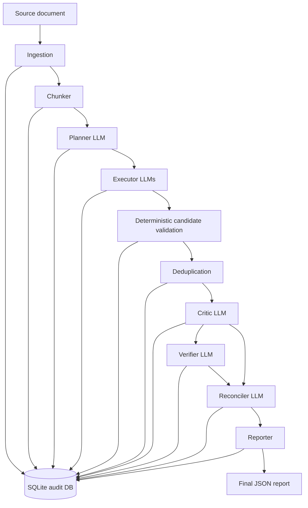

# Veritext System Flow Review

This document explains how the Veritext extraction application works end to end.
It is written for system review: another engineer or LLM can read it and suggest
accuracy, auditability, cost, or architecture improvements.

## Goal

Veritext extracts source-backed data points from documents while preserving:

- exact source text
- character and byte provenance
- stage-by-stage audit records
- explicit rejection reasons
- strict typed contracts between stages

The application prefers correctness and auditability over speed, elegance, and
token cost.

## High-Level Flow



## Stage Summary

| Stage | Main job | LLM? | Output |
|---|---|---:|---|
| Ingestion | Read source and compute document identity | No | `Document` |
| Chunker | Split document into token windows with offsets | No | `Chunk` records |
| Planner | Decide schema, categories, lenses, budget | Yes | `ExtractionPlan` |
| Executor | Extract candidate facts from each chunk/lens | Yes | `LensCandidate` records |
| Deterministic validation | Enforce schema and exact source spans | No | accepted/rejected candidates |
| Deduplication | Merge exact duplicate candidates | No | canonical candidates + dedup rejections |
| Critic | Review candidate plausibility and corrections | Yes | `CriticReport` records |
| Verifier | Independently verify accepted candidates | Yes | `VerifierReport` records |
| Reconciler | Merge verified candidates into final facts | Yes | `DataPoint` records |
| Reporter | Write final deterministic JSON report | No | report file + completed run manifest |

## Key Design Rule

Every LLM call must go through:

```text
src/extractor/llm/client.py
```

The code uses forced tool calls and validates the result with Pydantic. It does
not parse free-text JSON.

## Stage Details

### 1. Ingestion

Input:

```text
evals/fixtures/medium_research_brief/source.md
```

Output contract:

```text
Document
```

What it records:

- document ID
- source path
- source SHA-256
- extracted text SHA-256
- byte lengths
- page map

Why it matters:

All later provenance points back to this immutable document identity.

### 2. Chunker

Input:

```text
Document.text
```

Output contract:

```text
tuple[Chunk, ...]
```

Each chunk stores:

```json
{
  "chunk_id": "chunk-...",
  "doc_id": "doc-...",
  "chunk_index": 0,
  "text": "Revenue increased 12% year over year...",
  "start_char": 0,
  "end_char": 4200,
  "start_byte": 0,
  "end_byte": 4200,
  "start_token": 0,
  "end_token": 1200
}
```

Why it matters:

Executor, critic, and verifier only receive bounded chunk context. All source
offsets are absolute document offsets, not chunk-relative offsets.

### 3. Planner

Input:

- `Document`
- `Chunk` records
- optional domain hints

LLM calls:

1. `planner.classify_document`
2. `planner.propose_schema`
3. `planner.critique_schema`
4. `planner.select_strategy`
5. `planner.allocate_budget`

Output contract:

```text
ExtractionPlan
```

Example output:

```json
{
  "approved_categories": [
    {
      "name": "FinancialMetric",
      "fields": [
        {
          "name": "revenue_growth",
          "value_type": "text"
        }
      ]
    }
  ],
  "enabled_lenses": ["claim", "number"],
  "budget": {
    "lens_budgets": [
      {"lens": "claim", "max_calls": 2},
      {"lens": "number", "max_calls": 2}
    ]
  }
}
```

Review notes:

- Planner output can be verbose.
- Planner prompt caching is disabled because each planning call has a different
  prompt/tool prefix, which prevents useful Anthropic cache reuse.
- Runtime tuning values must remain in `config/`, not prompts or source code.

### 4. Executor

Input:

- approved schema card
- selected lens
- one chunk view

Current compact LLM input shape:

```json
{
  "schema_card": {
    "categories": [
      {
        "name": "FinancialMetric",
        "fields": [
          {"name": "revenue_growth", "value_type": "text"}
        ]
      }
    ],
    "enabled_lenses": ["claim", "number"]
  },
  "lens": "claim",
  "chunk_view": {
    "start_char": 0,
    "text": "Revenue increased 12% year over year..."
  }
}
```

LLM output shape:

```json
{
  "candidates": [
    {
      "category": "FinancialMetric",
      "field_name": "revenue_growth",
      "value": "12% year over year",
      "source_text": "Revenue increased 12% year over year",
      "start_char": 0,
      "confidence": 0.91
    }
  ]
}
```

Server expands this into:

```text
LensCandidate
```

The service derives:

- `end_char`
- `start_byte`
- `end_byte`
- stable `candidate_id`
- executor call provenance

It rejects candidates when:

- category is not approved
- field is not approved
- `source_text` does not match the chunk slice at `start_char`
- source span is ambiguous or invented

Review notes:

- Executor output is one of the largest token-cost drivers.
- A possible future optimization is a compact tuple wire format:

```json
{
  "candidates": [
    [0, 0, "12% year over year", "Revenue increased 12% year over year", 0, 0.91]
  ]
}
```

Where the server maps:

```text
[category_index, field_index, value, source_text, start_char, confidence]
```

The audit DB should still store the expanded full object.

### 5. Deterministic Candidate Validation

This is not an LLM stage.

It checks that each executor candidate is actually grounded in the chunk:

```text
chunk.text[start_char - chunk.start_char :
           start_char - chunk.start_char + len(source_text)]
==
source_text
```

If the claimed offset is wrong but `source_text` appears exactly once in the
chunk, the service may correct the offset. If the span is repeated or absent, it
records a rejection.

Example rejection:

```json
{
  "stage": "executor",
  "code": "invalid_source_offsets",
  "message": "Candidate source_text does not match chunk slice at start_char..."
}
```

Why it matters:

This prevents the LLM from inventing or approximating provenance.

### 6. Deduplication

Input:

```text
tuple[LensCandidate, ...]
```

Exact duplicate key:

```text
(chunk_id, category, field_name, source_span.text, value)
```

Output:

- canonical candidates sent to critic
- duplicate candidates recorded as `CandidateRejection(stage="dedup")`
- duplicate decisions later mirrored from the primary critic report

Example:

```json
{
  "stage": "dedup",
  "code": "duplicate_candidate",
  "message": "merged_into:candidate-primary..."
}
```

Review notes:

- This is conservative.
- It does not merge similar facts with different spans.
- It prevents silent drops by recording every duplicate.

### 7. Critic

Input:

- schema card
- chunk view
- compact candidate views

LLM input example:

```json
{
  "schema_card": {"categories": []},
  "chunk_view": {
    "start_char": 0,
    "text": "Revenue increased 12% year over year..."
  },
  "candidates": [
    {
      "id": "a1b2c3d4e5f6",
      "lens": "claim",
      "category": "FinancialMetric",
      "field_name": "revenue_growth",
      "value": "12% year over year",
      "span_start_char": 0,
      "span_text": "Revenue increased 12% year over year",
      "confidence": 0.91
    }
  ]
}
```

LLM output example:

```json
{
  "verdicts": [
    {
      "id": "a1b2c3d4e5f6",
      "decision": "accept"
    }
  ]
}
```

Reject example:

```json
{
  "verdicts": [
    {
      "id": "a1b2c3d4e5f6",
      "decision": "reject",
      "code": "critic_rejected",
      "evidence": "The value overstates the quoted span."
    }
  ]
}
```

Correction example:

```json
{
  "verdicts": [
    {
      "id": "a1b2c3d4e5f6",
      "decision": "correct",
      "code": "critic_rejected",
      "evidence": "The value should be narrowed.",
      "correction": {
        "value": "12%",
        "span_start_char": 18,
        "span_text": "12%"
      }
    }
  ]
}
```

Server behavior:

- expands short IDs back to full candidate IDs
- validates corrections against chunk text
- records `CriticReport`
- records explicit rejection if critic rejects or correction fails

Review notes:

- Evidence is strictly capped at 500 chars.
- Overlong evidence currently fails validation.
- A possible non-truncation fix is a strict retry/repair path for overlong
  evidence only.

### 8. Verifier

Input:

- schema card
- chunk view
- critic-accepted candidate views
- compact critic summary

LLM output example:

```json
{
  "verdicts": [
    {
      "id": "a1b2c3d4e5f6",
      "decision": "accept"
    }
  ]
}
```

Reject example:

```json
{
  "verdicts": [
    {
      "id": "a1b2c3d4e5f6",
      "decision": "reject",
      "code": "schema_violation",
      "evidence": "The candidate value does not align with the approved field."
    }
  ]
}
```

Server behavior:

- requires an accepted critic report before verification
- validates candidate identity and source spans
- combines LLM verdict with deterministic span/schema checks
- records `VerifierReport`
- records explicit rejection when verification fails

Review notes:

- Verifier evidence is also strictly capped at 500 chars.
- Deterministic span checks are authoritative.
- If the LLM rejects a valid span with a span-correctness code, the service can
  drop that hallucinated reason while preserving other reasons.

### 9. Reconciler

Input:

- verified candidates only
- compact schema card
- compact candidate views

LLM input example:

```json
{
  "schema_card": {"categories": []},
  "candidates": [
    {
      "id": "a1b2c3d4e5f6",
      "category": "FinancialMetric",
      "field_name": "revenue_growth",
      "value": "12% year over year",
      "span_text": "Revenue increased 12% year over year"
    }
  ]
}
```

LLM output example:

```json
{
  "data_points": [
    {
      "category": "FinancialMetric",
      "field_name": "revenue_growth",
      "value": "12% year over year",
      "source_candidate_id": "a1b2c3d4e5f6",
      "contributing_candidate_ids": ["a1b2c3d4e5f6"],
      "confidence": 0.91
    }
  ],
  "rejected_candidates": []
}
```

Server behavior:

- expands short IDs to full candidate IDs
- validates every referenced candidate exists
- builds full `DataPoint` records
- derives source span from the selected source candidate, not from the LLM
- ensures every verified candidate is accounted for exactly once
- records omitted candidates as reconciler rejections

Review notes:

- Reconciler output can be expensive because it may repeat category, field, value,
  candidate IDs, and rejection messages.
- A possible future optimization is compact tuple output for data points and
  rejection codes.

### 10. Reporter

Input:

```text
tuple[DataPoint, ...]
```

Output:

```text
Final JSON report
```

Reporter validates:

- run manifest exists
- audited data points match serialized data points
- output is deterministic
- output SHA-256 and byte length are recorded
- run manifest transitions to `completed`

Example final data point:

```json
{
  "data_point_id": "datapoint-...",
  "run_id": "medium-research-1",
  "doc_id": "doc-...",
  "category": "FinancialMetric",
  "field_name": "revenue_growth",
  "value": "12% year over year",
  "source_span": {
    "doc_id": "doc-...",
    "chunk_id": "chunk-...",
    "start_char": 0,
    "end_char": 39,
    "start_byte": 0,
    "end_byte": 39,
    "text": "Revenue increased 12% year over year"
  },
  "confidence": 0.91,
  "contributing_candidate_ids": ["candidate-..."],
  "critic_report_ids": ["critic-..."],
  "verifier_report_ids": ["verifier-..."],
  "reconciliation_decision_id": "reconcile-..."
}
```

## Audit Store

SQLite audit database:

```text
.veritext/audit.sqlite3
```

Main tables:

- `run_manifests`
- `documents`
- `chunks`
- `extraction_plans`
- `llm_call_logs`
- `lens_candidates`
- `critic_reports`
- `verifier_reports`
- `candidate_rejections`
- `data_points`

LLM call logs include:

```json
{
  "stage": "verifier",
  "model": "claude-sonnet-4-6",
  "input_tokens": 1817,
  "output_tokens": 966,
  "cache_read_tokens": 4444,
  "cache_creation_tokens": 0,
  "stop_reason": "tool_use",
  "tool_name": "verify_candidates_batch"
}
```

Audit inspection command:

```bash
PYTHONPATH=src python3 -m extractor.audit .veritext/audit.sqlite3 --run-id medium-research-1 --details
```

## Prompt Caching Behavior

Anthropic prompt caching is only useful when a later request reuses the exact
cached prefix. The cache prefix order is effectively:

```text
tools -> system -> messages
```

Current strategy:

- planner: cache disabled because each call has different prompt/tool prefix
- executor: cache only when multiple chunks exist, and only for stable schema/lens
  prefix before `chunk_view`
- critic: cache stable prompt/tool/schema/chunk prefix across candidate batches
- verifier: cache stable prompt/tool/schema/chunk prefix across item batches
- reconciler: one call, no useful repeat cache expected

Review notes:

- Cache helps input cost only.
- Output tokens are still the main cost floor.

## Current Cost Pattern

In the reviewed medium run, output tokens dominated cost. The model spends most
output on:

- executor candidate JSON
- planner schema/prose JSON
- reconciler data point/rejection JSON
- critic/verifier verdict JSON

Caching cannot reduce output tokens. Cost reductions should focus on:

1. shorter executor output
2. shorter critic/verifier verdict output
3. shorter reconciler output
4. removing planner prose that is not needed for typed contracts

## Example Mini Run

Source text:

```text
Acme revenue increased 12% year over year in Q1.
```

Planner approves:

```json
{
  "category": "FinancialMetric",
  "field": "revenue_growth"
}
```

Executor emits:

```json
{
  "candidates": [
    {
      "category": "FinancialMetric",
      "field_name": "revenue_growth",
      "value": "12% year over year",
      "source_text": "revenue increased 12% year over year",
      "start_char": 5,
      "confidence": 0.9
    }
  ]
}
```

Service validates:

```text
source_text matches source at start_char=5
```

Critic accepts:

```json
{
  "verdicts": [
    {"id": "a1b2c3d4e5f6", "decision": "accept"}
  ]
}
```

Verifier accepts:

```json
{
  "verdicts": [
    {"id": "a1b2c3d4e5f6", "decision": "accept"}
  ]
}
```

Reconciler emits:

```json
{
  "data_points": [
    {
      "category": "FinancialMetric",
      "field_name": "revenue_growth",
      "value": "12% year over year",
      "source_candidate_id": "a1b2c3d4e5f6",
      "contributing_candidate_ids": ["a1b2c3d4e5f6"],
      "confidence": 0.9
    }
  ],
  "rejected_candidates": []
}
```

Reporter writes a full audited data point with exact source span and report IDs.

## Review Questions For Another LLM

Use these questions when asking another model to review the system:

1. Which stages are doing work that can be made deterministic without hurting
   recall?
2. Which LLM output fields are verbose but not needed for downstream decisions?
3. Can executor output use compact category/field indexes safely?
4. Can critic/verifier use compact verdict tuples while preserving validation?
5. Should overlong evidence trigger targeted retry instead of run failure?
6. Can reconciler output use compact grouped IDs and deterministic rejection
   messages?
7. Are any current cache writes unlikely to receive cache reads?
8. Are there invariant gaps where a candidate or data point could be silently
   dropped?
9. Are byte/character offsets always derived or validated server-side?
10. Are there tests that should be added before changing the LLM wire format?

## Suggested Improvement Areas

### Compact LLM Wire Format

Use compact tuples only at the LLM boundary:

```text
LLM compact tuple -> service expansion -> Pydantic validation -> full audit row
```

Do not store compact tuples in the audit database. The audit DB should remain
human-readable and explicit.

### Targeted Retry For Repairable Validation Errors

Some validation failures are repairable without weakening invariants, such as:

- overlong `evidence`
- repeated verdict IDs
- missing verdict for a candidate

Riskier failures should stay hard failures:

- invalid source offsets
- invented source span
- unknown candidate ID
- unknown category or field

### Cost Observability

Track per-stage:

- calls
- input tokens
- output tokens
- cache read tokens
- cache creation tokens
- accepted/rejected candidate counts
- data point counts

The goal is to know whether a change reduced cost by reducing real work or by
quietly losing recall.

## Token Problems Observed

The current system has several token-cost and token-shape problems that need
review.

### 1. Output Tokens Dominate Cost

For the medium research run, most cost came from model output, not input.
Anthropic Sonnet output tokens are much more expensive than input tokens, so
prompt caching alone cannot solve the cost problem.

Example cost pattern from a medium run:

```text
output tokens ~= 34k
output cost   ~= $0.51
total cost    ~= $0.82
```

This means even perfect input caching would not push the run much below the
output-token floor.

Main output sources:

- executor candidate JSON
- planner schema and rationale JSON
- critic/verifier verdict JSON
- reconciler data point and rejection JSON

### 2. JSON Object Keys Are Repeated Many Times

LLM tool outputs repeat keys for every record.

Executor example:

```json
{
  "category": "FinancialMetric",
  "field_name": "revenue_growth",
  "value": "12% year over year",
  "source_text": "Revenue increased 12% year over year",
  "start_char": 1842,
  "confidence": 0.91
}
```

Repeated keys like `category`, `field_name`, `source_text`, `start_char`, and
`confidence` add up when the executor emits many candidates.

Possible compact wire format:

```json
[
  0,
  2,
  "12% year over year",
  "Revenue increased 12% year over year",
  1842,
  0.91
]
```

Meaning:

```text
[category_index, field_index, value, source_text, start_char, confidence]
```

Important constraint:

This compact shape should exist only at the LLM boundary. The service should
immediately expand it into full Pydantic models, validate it, and store full
explicit objects in the audit DB.

### 3. Repeated Category And Field Names Add Cost

Many outputs repeat schema names:

```json
"category": "FinancialMetric",
"field_name": "revenue_growth"
```

These can be replaced in LLM outputs by schema indexes:

```json
[0, 2, "..."]
```

The server can map index `0` to the category and index `2` to the field. This
reduces output tokens while preserving the explicit audited object after
expansion.

### 4. Evidence Strings Can Exceed Schema Limits

Observed failure:

```text
ValidationError: verdicts.12.evidence
String should have at most 500 characters
```

The verifier returned an overlong `evidence` string. The current system keeps
strict validation and does not truncate evidence.

Possible fix:

- detect this specific validation error
- retry the same batch with a repair instruction
- require evidence to be under the schema cap
- validate strictly again

Do not silently truncate evidence, because that can hide model behavior and
weaken auditability.

### 5. Some Cache Writes Had No Useful Reads

Prompt caching only helps when later calls reuse the exact cached prefix. The
cache prefix order is:

```text
tools -> system -> messages
```

Problems found:

- planner calls use different prompt/tool combinations, so planner cache writes
  were not useful
- executor was writing full chunk payloads into cache even when there was no
  later reuse

Current mitigation:

- planner prompt caching disabled
- executor caching only enabled when there are multiple chunks
- executor cached prefix split before `chunk_view`
- critic/verifier caching kept because repeated batch calls can reuse stable
  schema/chunk prefixes

### 6. Larger Batches Reduce Calls But Not Output Records

Increasing critic/verifier batch size reduces the number of LLM calls and can
help latency and input overhead.

But it does not remove the need to output one verdict per candidate:

```json
{
  "verdicts": [
    {"id": "a1", "decision": "accept"},
    {"id": "a2", "decision": "reject", "code": "schema_violation"}
  ]
}
```

So batching helps, but it does not solve the output-token floor.

### 7. Best Current Direction

The best next cost-reduction direction is:

```text
compact LLM wire format
-> service expansion
-> Pydantic validation
-> full audit storage
```

Recommended priority:

1. compact executor candidate output
2. compact critic/verifier verdict output
3. compact reconciler output
4. reduce planner prose fields
5. add targeted retry for repairable validation failures like overlong evidence

Do not reduce cost by dropping source text, skipping critic/verifier, weakening
Pydantic validation, or storing compact tuples in the audit DB.
